# hash4j

[](https://opensource.org/licenses/Apache-2.0)
[](https://search.maven.org/search?q=g:%22com.dynatrace.hash4j%22%20AND%20a:%22hash4j%22)
[](https://javadoc.io/doc/com.dynatrace.hash4j/hash4j)

[](https://sonarcloud.io/summary/new_code?id=dynatrace-oss_hash4j)
[](https://sonarcloud.io/summary/new_code?id=dynatrace-oss_hash4j)
[](https://docs.oracle.com/javase/11/)

hash4j is a Java library by Dynatrace that includes various non-cryptographic hash algorithms and data structures that are based on high-quality hash functions.

## Hash Algorithms
hash4j currently implements the following hash algorithms:
* [Murmur3](https://github.com/aappleby/smhasher/blob/master/src/MurmurHash3.cpp) (128-bit and 32-bit)
* [Wyhash](https://github.com/wangyi-fudan/wyhash) (final version 3)
* [Komihash](https://github.com/avaneev/komihash) (version 4.3)

All hash functions are thoroughly tested against the native reference implementations and also other libraries like [Guava Hashing](https://javadoc.io/doc/com.google.guava/guava/latest/com/google/common/hash/package-summary.html), [Zero-Allocation Hashing](https://github.com/OpenHFT/Zero-Allocation-Hashing), [Apache Commons Codec](https://commons.apache.org/proper/commons-codec/apidocs/index.html), or [crypto](https://github.com/appmattus/crypto) (see [CrossCheckTest.java](src/test/java/com/dynatrace/hash4j/hashing/CrossCheckTest.java)).
 
### Usage
The interface allows direct hashing of Java objects in a streaming fashion without first mapping them to byte arrays. This minimizes memory allocations and keeps the memory footprint of the hash algorithm constant regardless of the object size.
```java
class TestClass { 
    int a = 42;
    long b = 1234567890L;
    String c = "Hello world!";
}

TestClass obj = new TestClass(); // create an instance of some test class
    
Hasher64 hasher = Hashing.wyhashFinal3(); // create a hasher instance

// variant 1: hash object by passing data into a hash stream
long hash1 = hasher.hashStream().putInt(obj.a).putLong(obj.b).putString(obj.c).getAsLong(); // gives 0x2cf18e9ee8fd3546L

// variant 2: hash object by defining a funnel
HashFunnel<TestClass> funnel = (o, sink) -> sink.putInt(o.a).putLong(o.b).putString(o.c);
long hash2 = hasher.hashToLong(obj, funnel); // gives 0x2cf18e9ee8fd3546L
```
More examples can be found in [HashingDemo.java](src/test/java/com/dynatrace/hash4j/hashing/HashingDemo.java).

## UltraLogLog
UltraLogLog is a more space-efficient alternative to [HyperLogLog](https://en.wikipedia.org/wiki/HyperLogLog) for approximate counting of distinct items. It has the following properties:
* Constant-time and branch-free add-operation
* Allocation-free updates
* Adding items already inserted before will never change the internal state
* Mergeability, support of merging sketches initialized with different precision parameters   
* Final state is independent of order of add- and merge-operations
* Fast estimation algorithm that is fully backed by theory and does not rely on magic constants

### Usage
```java
Hasher64 hasher = Hashing.wyhashFinal3(); // create a hasher instance

UltraLogLog sketch = UltraLogLog.create(12); // corresponds to a standard error of 1.2% and requires 4kB

sketch.add(hasher.hashCharsToLong("foo"));
sketch.add(hasher.hashCharsToLong("bar"));
sketch.add(hasher.hashCharsToLong("foo"));

double distinctCountEstimate = sketch.getDistinctCountEstimate(); // gives a value close to 2
```
See also [UltraLogLogDemo.java](src/test/java/com/dynatrace/hash4j/distinctcount/UltraLogLogDemo.java).

### Estimation Error

The state of an UltraLogLog sketch with precision parameter $p$ requires $m = 2^p$ bytes. The expected relative standard error is approximately given by $\sqrt{\frac{\frac{8317}{3528}\ln(2)-1}{m}}\approx \frac{0.796}{\sqrt{m}}.$ This theoretically derived formula is a good approximation for all $p\geq 6$ and large distinct counts. However, the error is significantly smaller for distinct counts that are in the order of $m$ or smaller. The bias is always much smaller than the root-mean-square error (rmse) and can therefore be neglected. The following charts show the empirically evaluated relative error as a function of the true distinct count for various precision parameters based on 100k simulation runs.   


| precision | error chart | precision | error chart |
| -------------:  | :------------- | -------------:  | :------------- |
| 3              | 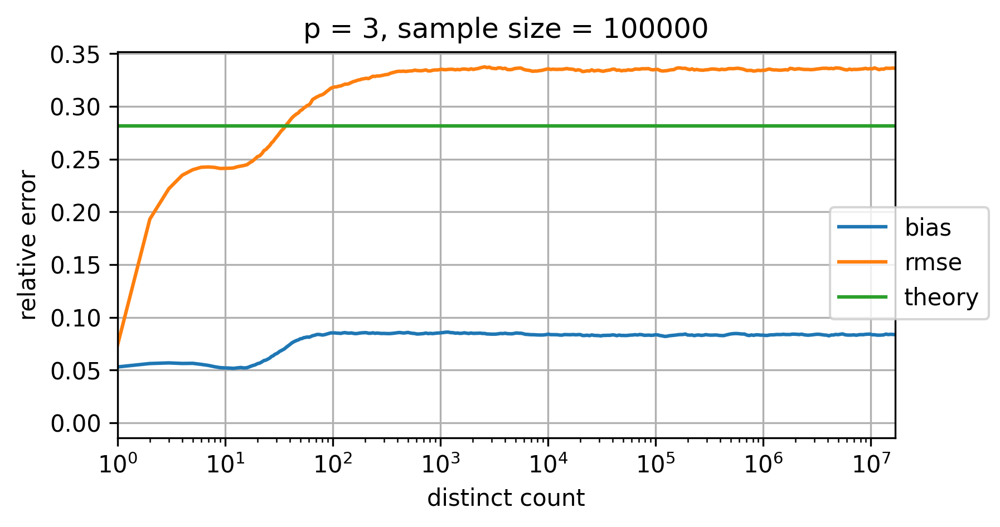  | 10       | 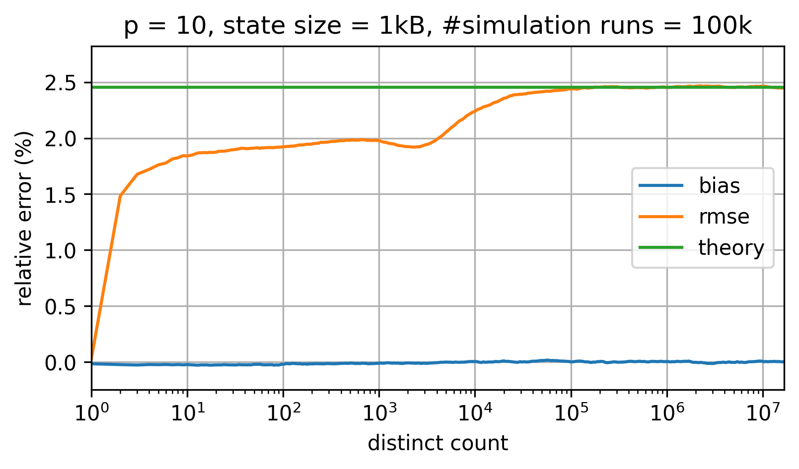  |
| 4              | 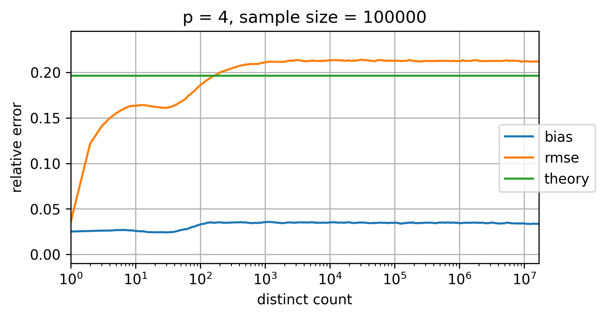  | 11       | 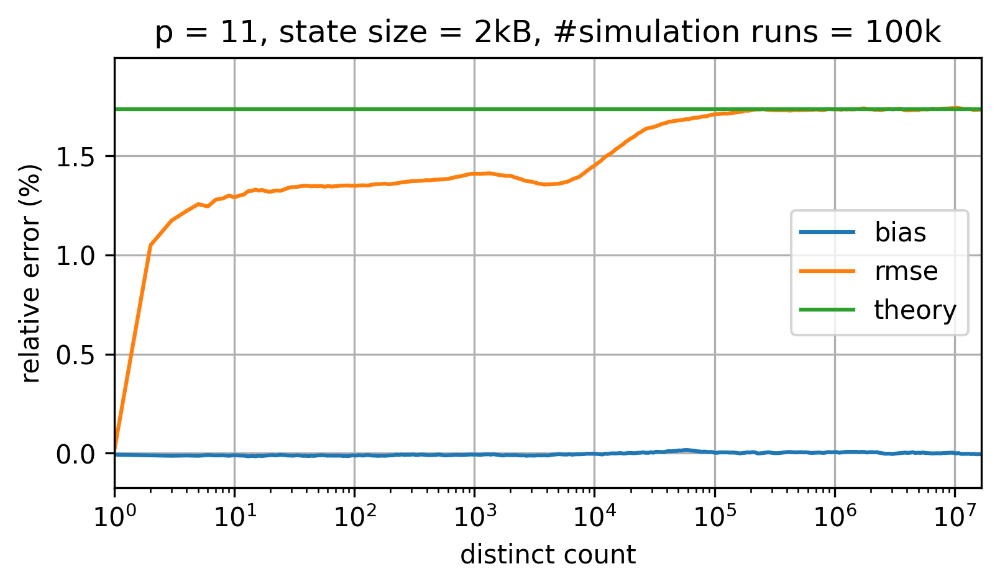  |
| 5              | 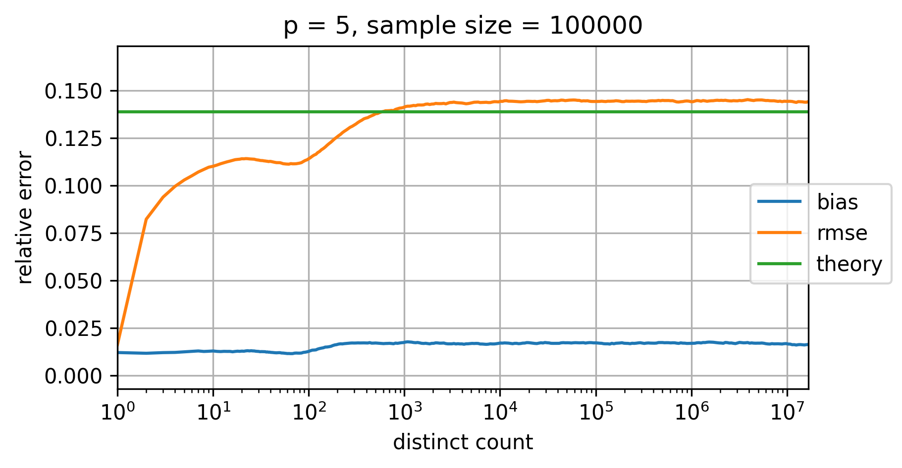  | 12       | 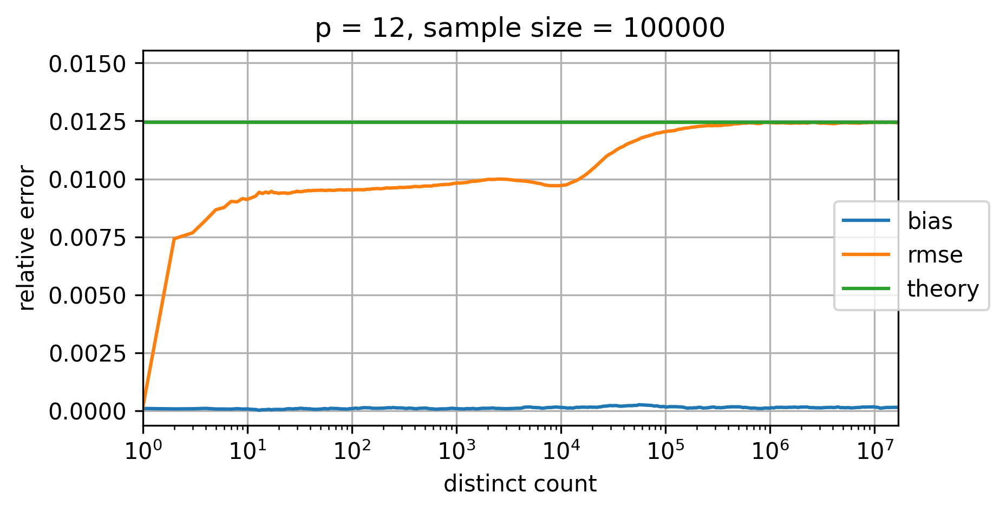  |
| 6              | 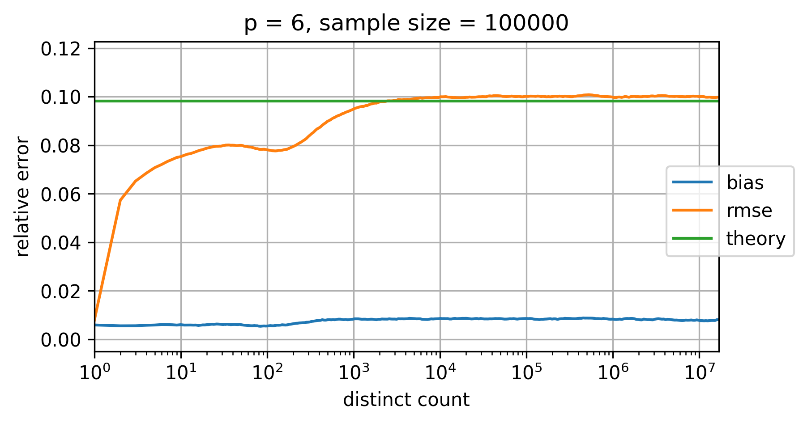  | 13       | 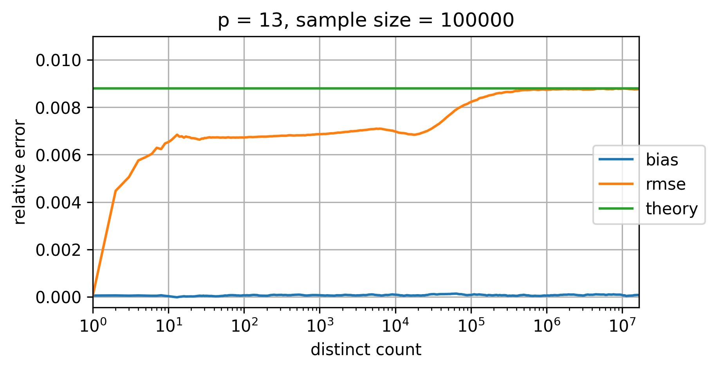  |
| 7              | 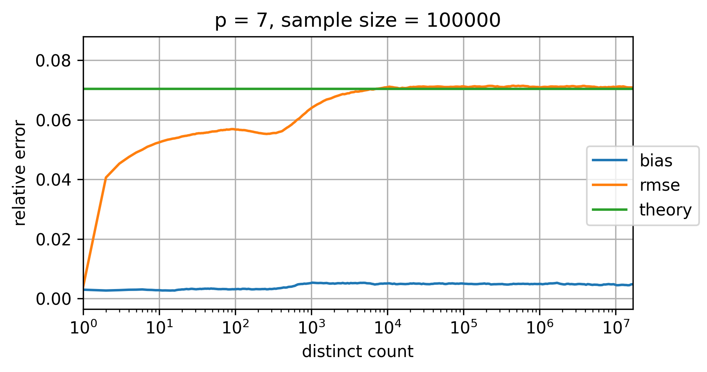  | 14       | 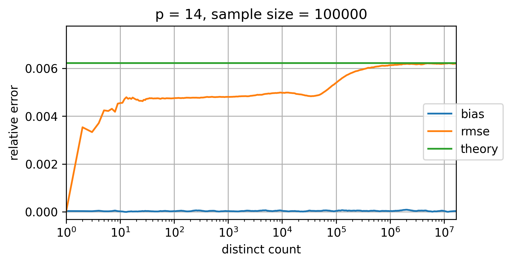  |
| 8              | 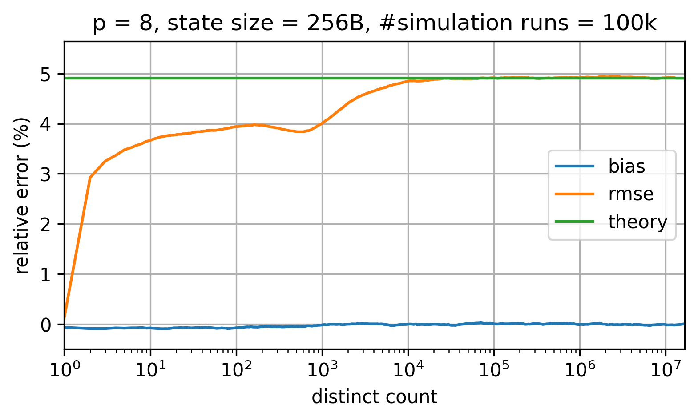  | 15       | 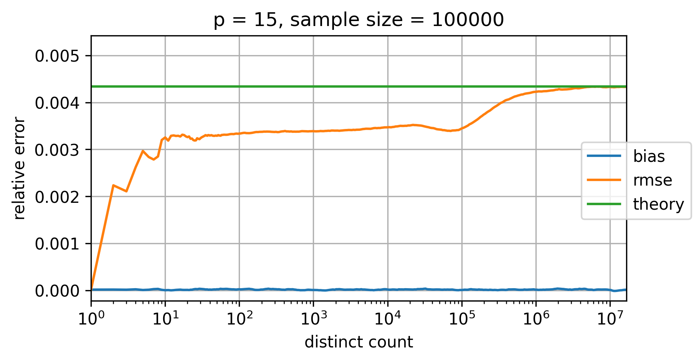  |
| 9              | 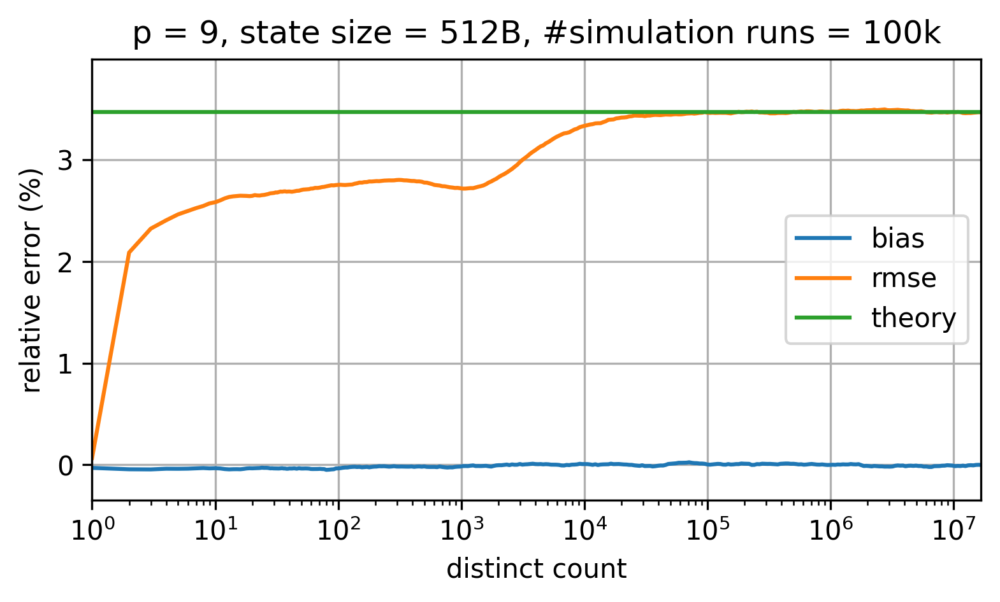  | 16       |   |
