### HyperLogLog estimation error

The state of an HyperLogLog sketch with precision parameter $p$ requires $m = 0.75 \cdot 2^p$ bytes. The expected relative standard error is approximately given by
$\frac{1.039}{\sqrt{m}}$. This is a good approximation for all $p\geq 6$ and large distinct counts. However, the error is significantly smaller for distinct counts that are in the order of $m$ or smaller. The bias is always much smaller than the root-mean-square error (rmse) and can therefore be neglected. The following charts show the empirically evaluated relative error as a function of the true distinct count for various precision parameters $p$ based on 100k simulation runs:

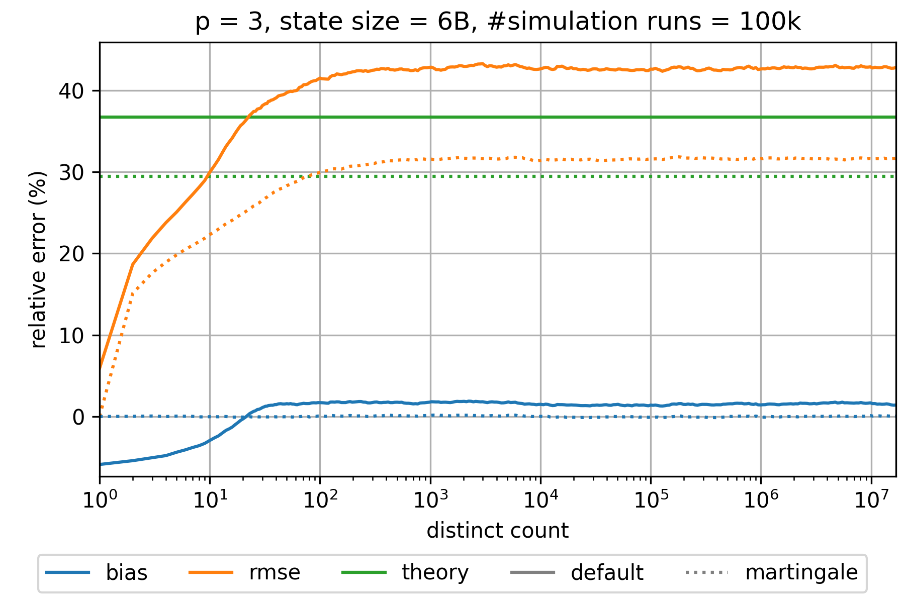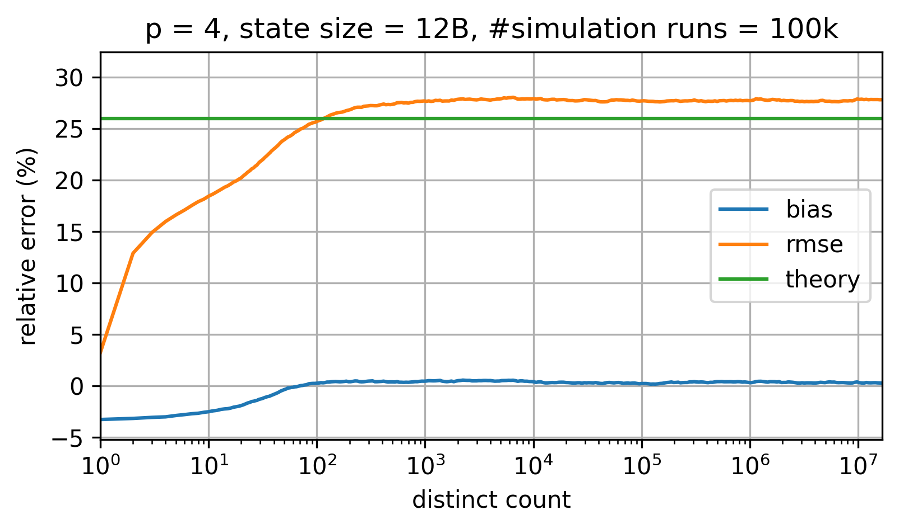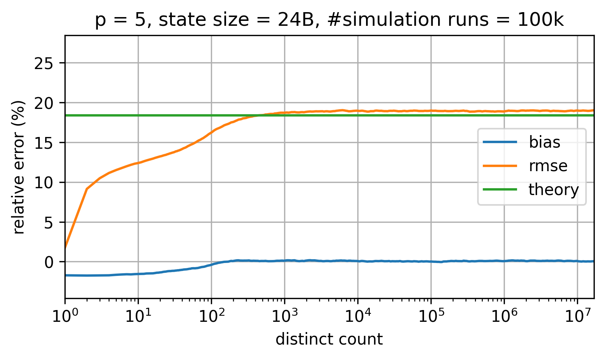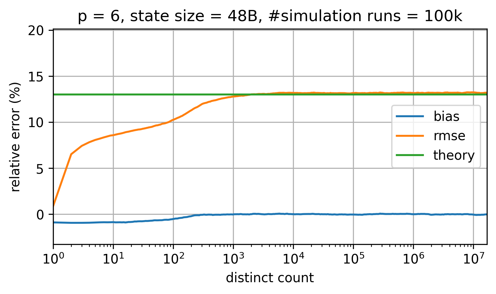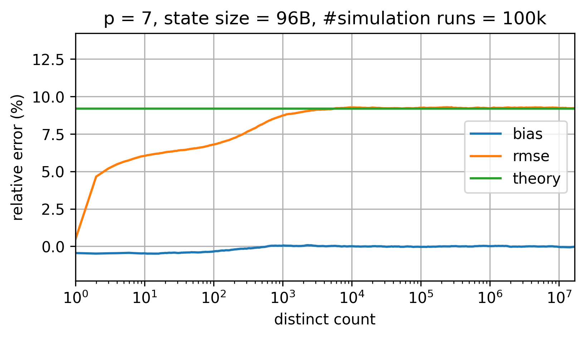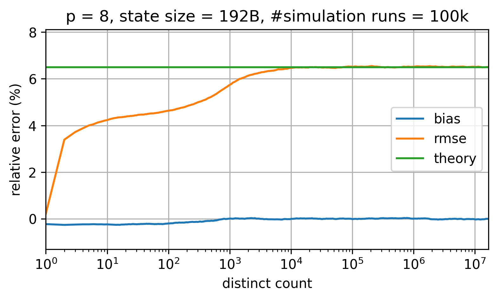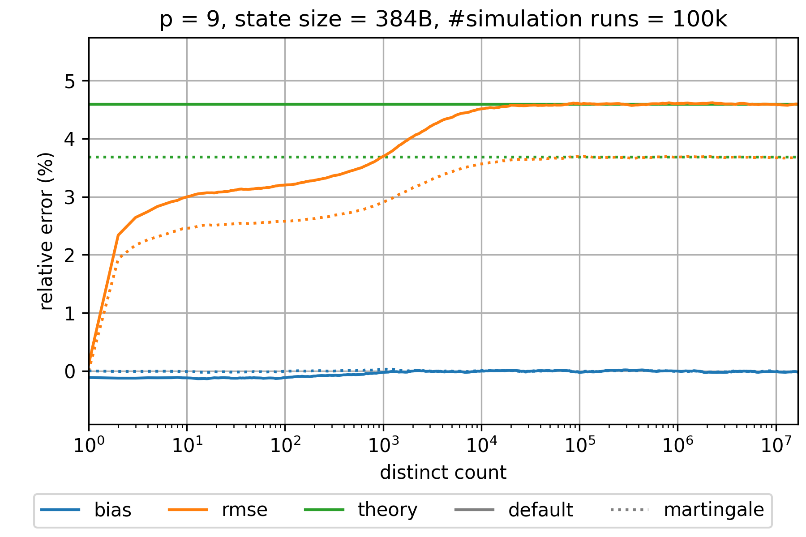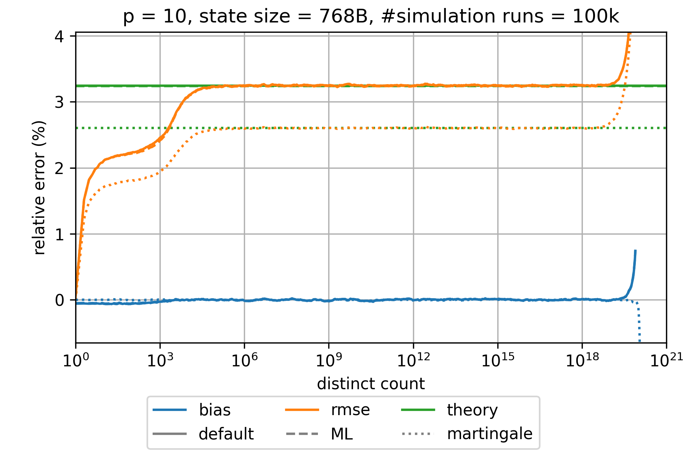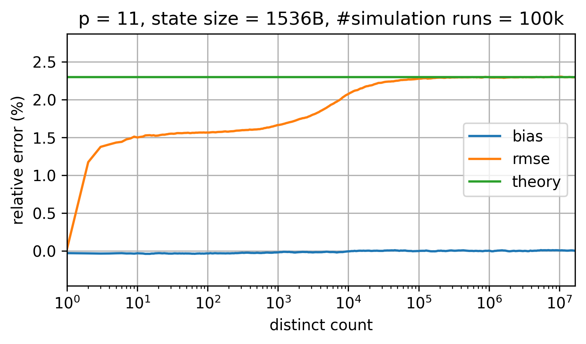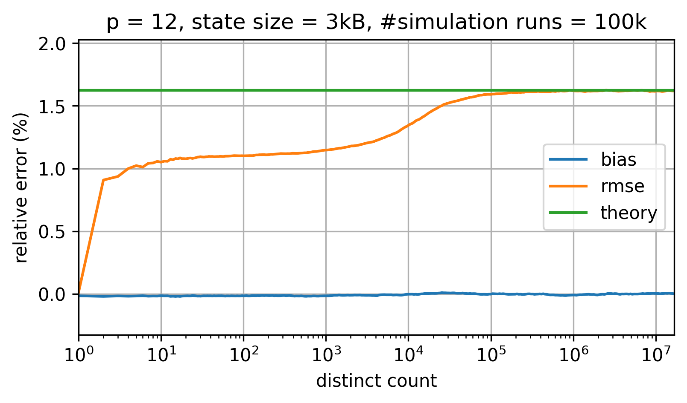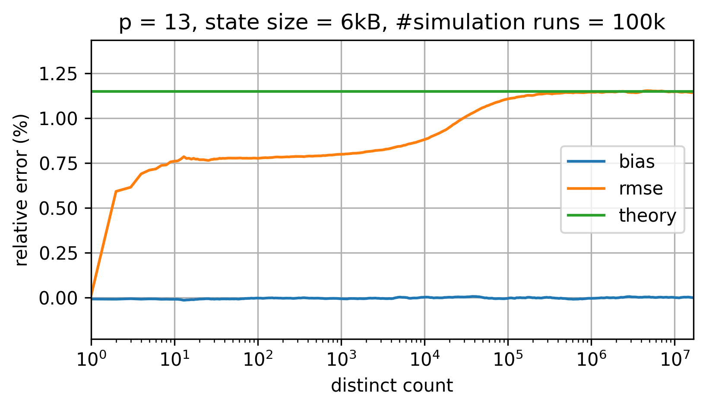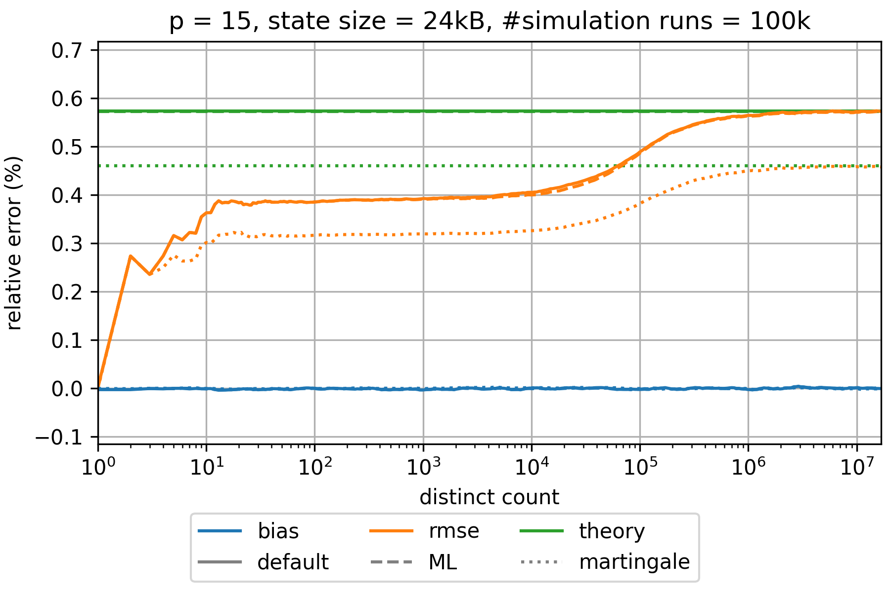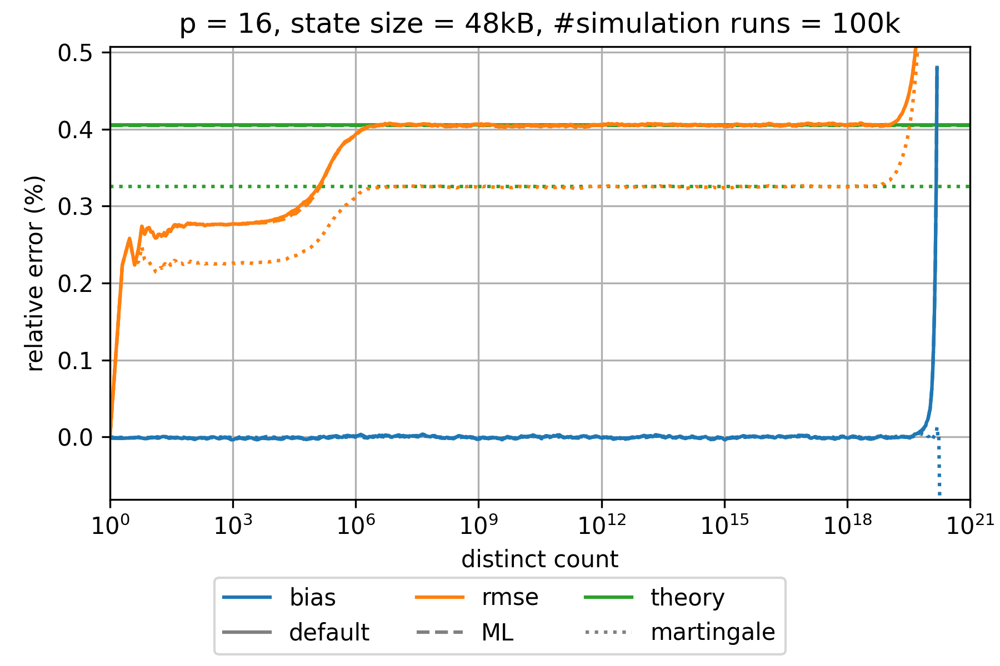
