### UltraLogLog estimation error

The state of an UltraLogLog sketch with precision parameter $p$ requires $m = 2^p$ bytes where $m$ denotes the number of registers.
The expected relative standard error is approximately given by $\frac{0.782}{\sqrt{m}}$, $\frac{0.761}{\sqrt{m}}$,
and $\frac{0.658}{\sqrt{m}}$ for the default, the maximum-likelihood (ML), and the martingale estimator, respectively.
This is a good approximation for all $p\geq 6$ and large distinct counts.
However, the error is significantly smaller for distinct counts that are in the order of $m$ or smaller.
The bias is always much smaller than the root-mean-square error (rmse) and can therefore be neglected.
The following charts show the empirically determined relative error as a function of the true distinct count for various precision parameters $p$ based on 100k simulation runs. Distinct counts up to 1M were simulated by generating random values as hash values. For distinct counts above 1M, a different technique is used by randomly generating only hash values at distinct counts that can actually change the state of the data structure.

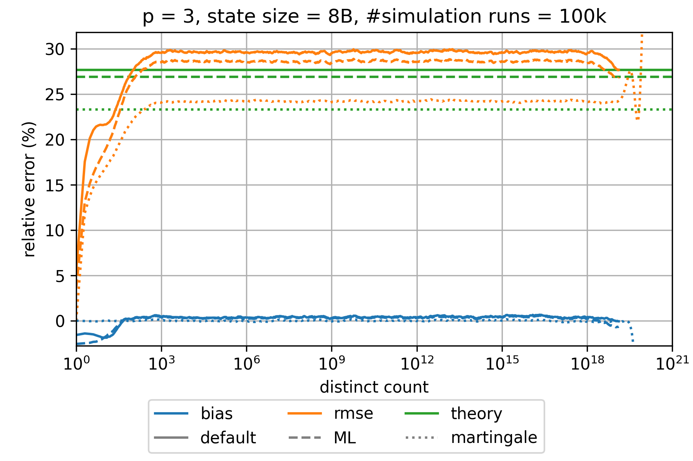
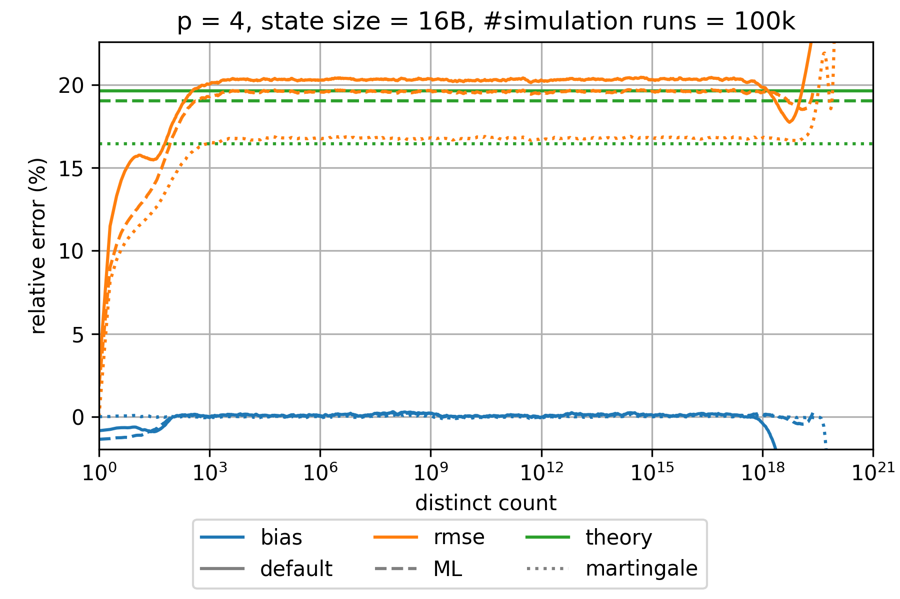
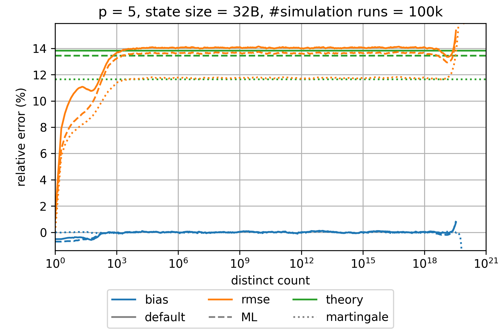
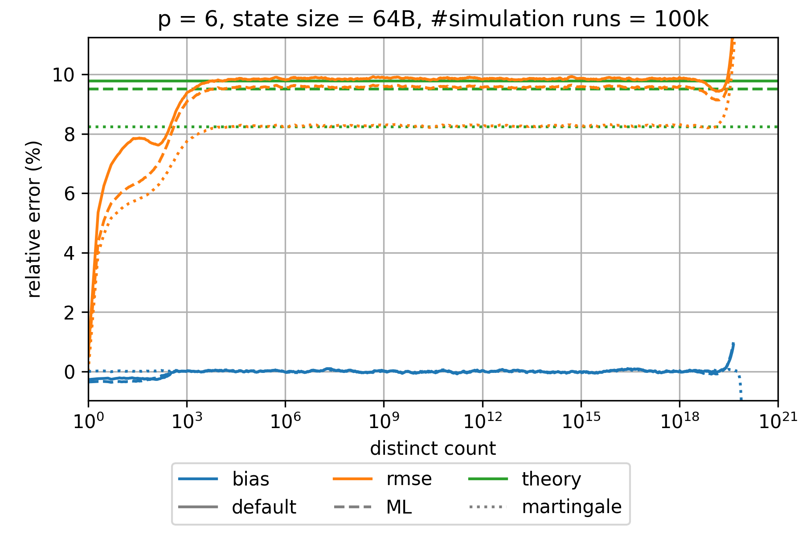
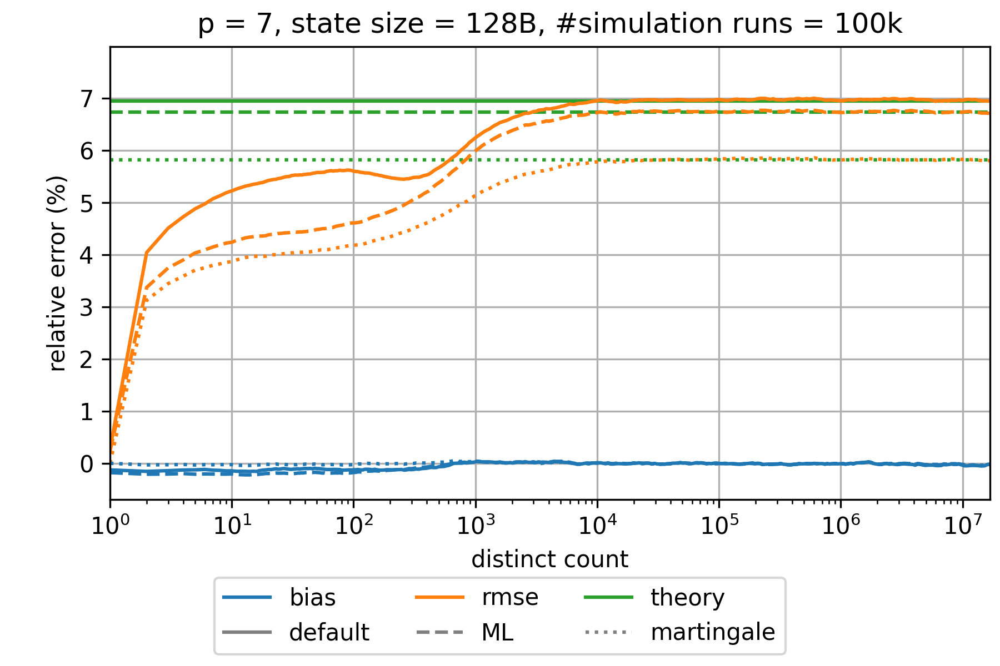

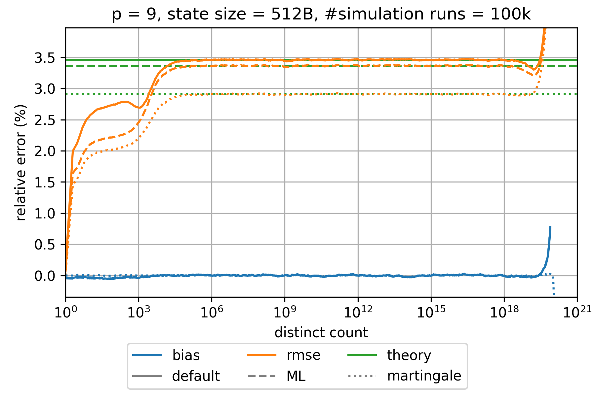
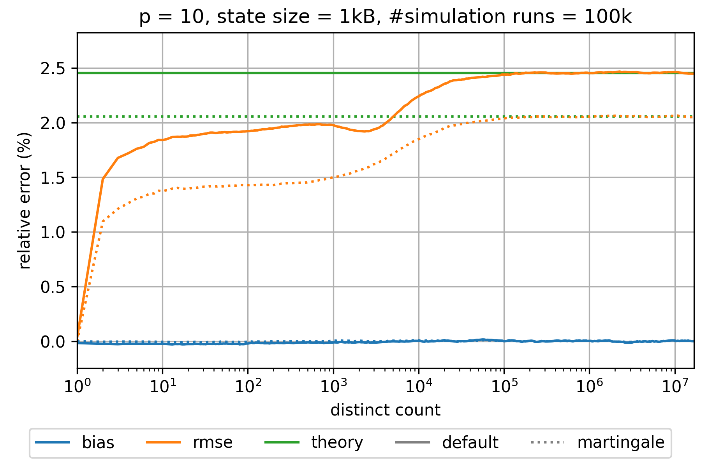
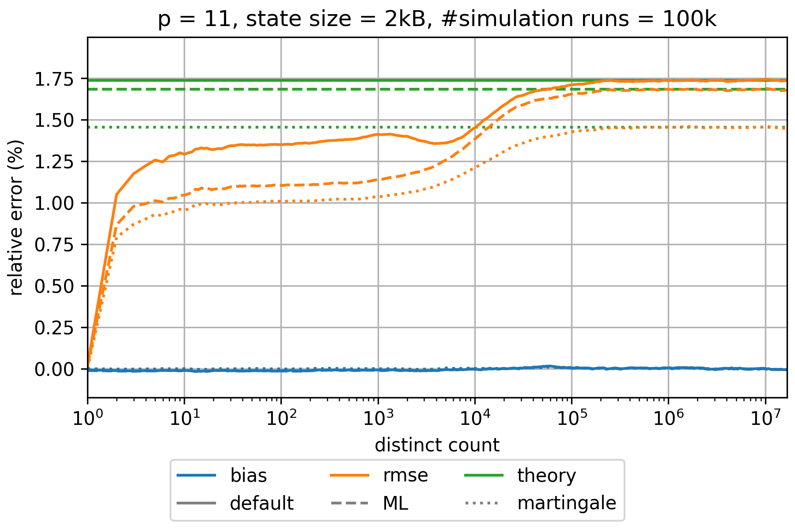
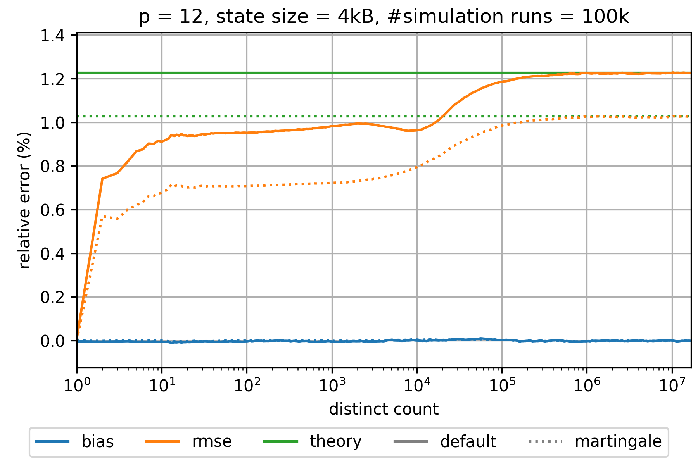
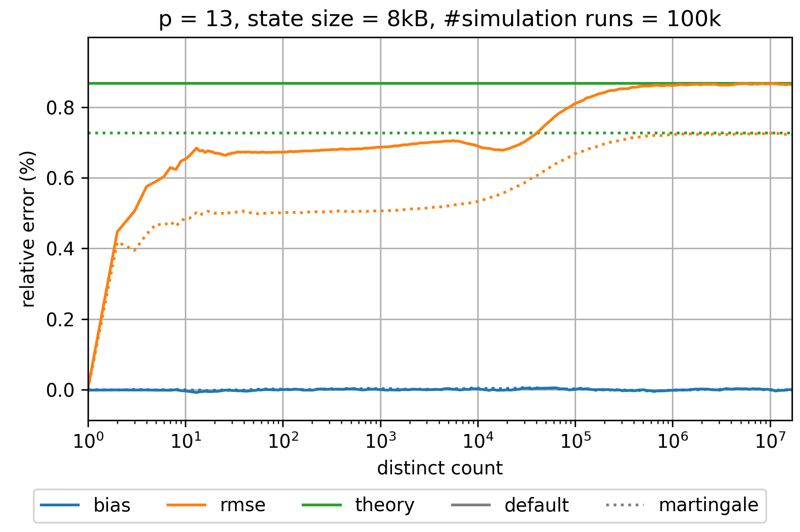
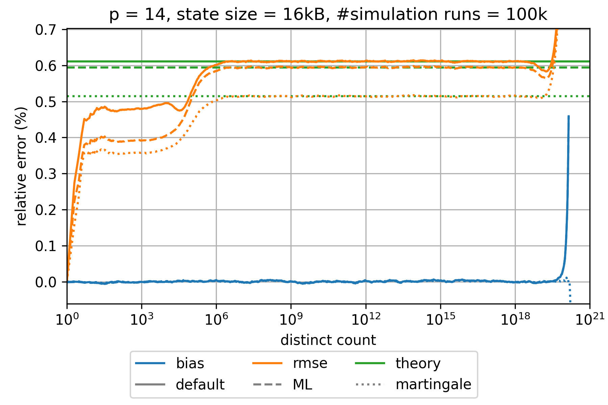
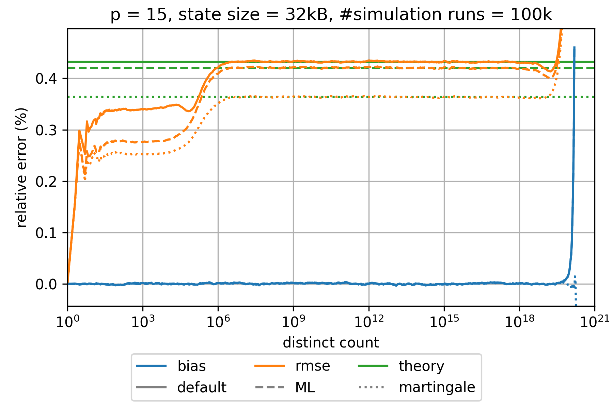
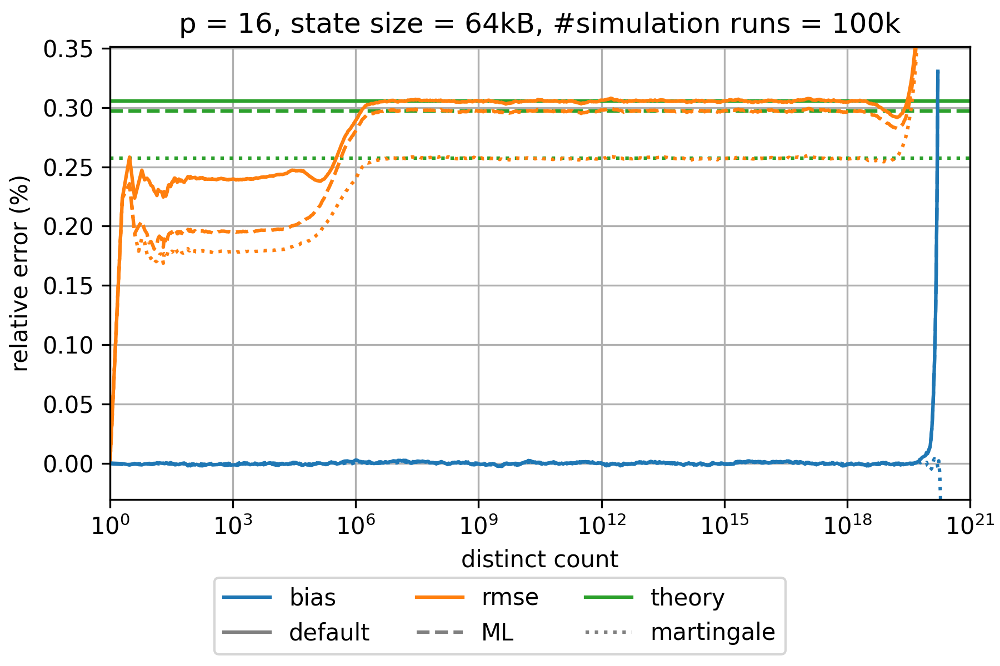
